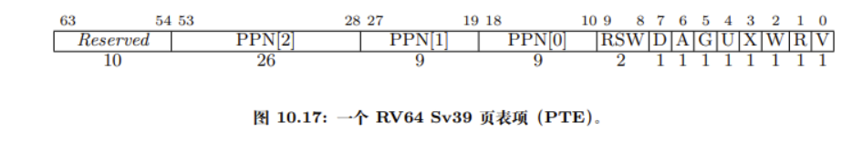

# 功能实现

在ch4的实验中，我做了如下工作：
1. 重写 sys_get_time 和 sys_task_info，使其支持传入的虚拟地址参数，以及跨页写入。跨页写入直接模仿sys_write即可。
2. 设计sys_mmap，支持在对应进程的地址空间形成一段地址映射、分配物理内存，并支持相关错误判定。
3. 设计sys_munmap, 支持取消指定虚拟地址的地址映射，并回收对应的物理内存。

# 问答题
A1: V代表该表项是否有效，RWX代表权限控制，U位代表是否是用户页，U=0代表只有S态可访问，U=1代表只有用户态可访问。G代表该页是否存在于所有地址空间，A位代表该页是否被访问过，D位代表该页是否被写入过，PPN是物理页号,Reserved是保留位，可自定义。

A2-1：页面不存在异常（Page Falut），非法内存访问异常（Illegal Access Fault）。

A2-2：
1. stval：存放导致缺页异常的虚拟地址；
2. scause：指示缺页异常的具体原因;
3. sepc：存储发生缺页异常时的指令地址。

A2-3：
1. 减少无意义的内存占用，提高内存使用效率；
2. 减少启动时的磁盘IO，提高启动速度

A2-4：一个页4KB，一个页表项8B，所以大概需要20GB / 512，即几十M的页表。

A2-5：缺页中断发生后，操作系统检查页面的虚拟地址对应的文件或数据位置，完成分配和加载操作，更新页表项，将页面标记为有效，再返回用户态继续执行。

A2-6：当页面被换出到磁盘时，页表项中的有效位（V位）将被清除（设为0），表示该页不在内存中，访问会触发缺页异常。同时，PTE 中可能会保留其他标志位（如标记为可换出状态），以便缺页时识别是这种情况，然后从磁盘加载数据到内存中。

A3-1：在切换程序时才切换页表，切换时将satp改为另一个程序的页表基址即可。

A3-2：在内核页面的页表项设置U=0，只有内核可以访问。

A3-3：不用每次syscall进入内核态都要更换页表，频繁改变页表会使得TLB 命中率下降，影响地址转换性能。

A3-4：双页表下一旦进入到内核态，便要立即更换页表，而单页表模式，只有当多道程序分时运行需要切换进程时，才要切换页表。

# 荣誉准则

1. 在完成本次实验的过程（含此前学习的过程）中，我曾分别与 以下各位 就（与本次实验相关的）以下方面做过交流，还在代码中对应的位置以注释形式记录了具体的交流对象及内容：

    《你交流的对象说明》

2. 此外，我也参考了 以下资料 ，还在代码中对应的位置以注释形式记录了具体的参考来源及内容：

    《你参考的资料说明》

3. 我独立完成了本次实验除以上方面之外的所有工作，包括代码与文档。 我清楚地知道，从以上方面获得的信息在一定程度上降低了实验难度，可能会影响起评分。

4. 我从未使用过他人的代码，不管是原封不动地复制，还是经过了某些等价转换。 我未曾也不会向他人（含此后各届同学）复制或公开我的实验代码，我有义务妥善保管好它们。 我提交至本实验的评测系统的代码，均无意于破坏或妨碍任何计算机系统的正常运转。 我清楚地知道，以上情况均为本课程纪律所禁止，若违反，对应的实验成绩将按“-100”分计。